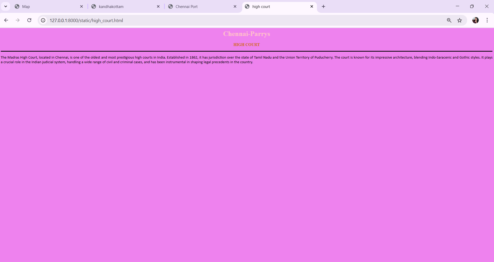

# Ex03 Places Around Me
## Date: 29-11-2025

## AIM
To develop a website to display details about the places around my house.

## DESIGN STEPS

### STEP 1
Create a Django admin interface.

### STEP 2
Download your city map from Google as an image.

### STEP 3
Insert the image using `````` tag and link it to the map.

### STEP 4
Using ```<map>``` tag name the map.

### STEP 5
Create clickable regions in the image using ```<area>``` tag.

### STEP 6
Write HTML programs for all the regions identified.

### STEP 7
Execute the programs and publish them.

## CODE

```
map.html

<html>
    <head>
        <title>Map</title>
    </head>
    <body>
        <h1 align="center"><font color="red">Chennai-Parrys</font></h1>
        <h2 align="center">Madhu shruthi.A.R (25008368)</h2>
        


<map name="image-map">
    <area target="" alt="FORT ST. GEORGE" title="FORT ST. GEORGE" href="fortst_george.html" coords="956,805,1191,890" shape="rect">
    <area target="" alt="CHENNAI PORT" title="CHENNAI PORT" href="chennai_port.html" coords="1364,618,117" shape="circle">
    <area target="" alt="MADRAS HIGH COURT" title="MADRAS HIGH COURT" href="high_court.html" coords="959,596,1153,502,967,585,1140,598" shape="0">
    <area target="" alt="MARINA BEACH" title="MARINA BEACH" href="beach.html" coords="1215,290,1368,203" shape="rect">
    <area target="" alt="KANDHAKOTTAM TEMPLE" title="KANDHAKOTTAM TEMPLE" href="kandhakottam.html" coords="638,520,108" shape="circle">
</map>
        
    </body>
</html>

beach.html

<html>
    <head>
        <title>Marina beach</title>
    </head>
    <body bgcolor="wheat">
        <h1 align="center">
            <font color="brown"><b>Chennai-Parrys</b></font>
        </h1>
        <h3 align="center">
            <font color="chocolate"><b>Marina beach</b></font>


        </h3>
        <hr size="3" color="black">
        <p align="justify">
            <font face="Garamond" size="3">
                    Marina Beach in Chennai is one of the longest urban beaches in the world,
                    stretching along the Bay of Bengal. It is a lively spot where locals and tourists 
                    gather to enjoy morning walks, sunsets, and street food. The beach is also famous 
                    for its cultural landmarks, statues, and vibrant atmosphere, making it a must-visit
                    destination in Chennai.
            </font>
        </p>
    </body>
</html>

chennai_port.html

<html>
    <head>
        <title>Chennai Port</title>
    </head>
    <body bgcolor="skyblue">
        <h1 align="center">
            <font color="white"><b>Chennai-Parrys</b></font>

        </h1>
        <h3 align="center">
            <font color="white"><b>Chennai Port</b></font>
        </h3>
        <hr size="3" color="black">
        <p align="justify">
            <font face="Arial" size="4">
                Chennai Port is one of the largest ports in India, located in the 
                city of Chennai. It plays a crucial role in the maritime trade of 
                the region, handling a significant volume of cargo and serving as
                a gateway for imports and exports. The port is equipped with modern 
                facilities and infrastructure to support various types of vessels 
                and cargo operations. It is an important hub for the economic 
                development of Chennai and the surrounding areas.
            </font>


            </font>

        </p>

    </body>
</html> 

fortst_george.html

<html>
    <head>
        <title>fort st george</title>
    </head>
    <body bgcolor="pink">
        <h1 align="center">
            <font color="purple"><b>Chennai-Parrys</b></font>
        </h1>
        <h3 align="center">
            <font color="white"><b>FORT ST. GEORGE</b></font>
        </h3>
        <hr color="black" size="3">
        <p align="justify">
            <font face="Georgia" size="4">
                        The Birthplace of Madras. This is the first English fortress built in India,
                        established in 1644. It houses the Fort Museum,
                        which displays artifacts from the British Raj, and
                        It currently serves as the administrative headquarters for 
                        the Government of Tamil Nadu
            </font>
        </p>

    </body>
</html>

kandhakottam.html

<html>
    <head>
        <title>kandhakottam</title>
    </head>
    <body bgcolor="lightyellow">
        <h1 align="center">
            <font color="orange"><b>Chennai-Parrys</b></font>
        </h31>
        <h3 align="center">
            <font color="brown"><b>Kandhakottam temple</b></font>
        <hr size="3" color="black">
        <p align="justify">
            <font face="Arial" size="4">
                Kandhakottam, also known as Murugan Temple, is a revered Hindu temple located in Chennai. 
                Dedicated to Lord Murugan, the temple is an important pilgrimage site for devotees. 
                It features traditional Dravidian architecture with intricate carvings and vibrant sculptures. 
                The temple hosts various festivals and rituals throughout the year, attracting numerous visitors 
                who come to seek blessings and participate in the spiritual activities.
            </font>
        </p>

  </body>
</html>

high_court.html

<html>
    <head>
        <title>high court</title>
    </head>
    <body bgcolor="violet">
        <h1 align="center">
            <font color="pink"><b>Chennai-Parrys</b></font>

        </h1>
        <h3 align="center">
            <font color="chocolate"><b>HIGH COURT</b></font>

        </h3>
        <hr color="black" size="3">
        <p align="justify">
            <font face="Calibri" size="4">
                The Madras High Court, located in Chennai, is one of the oldest and 
                most prestigious high courts in India. Established in 1862, 
                it has jurisdiction over the state of Tamil Nadu and the Union
                Territory of Puducherry. The court is known for its impressive architecture, 
                blending Indo-Saracenic and Gothic styles. It plays a crucial role in the Indian judicial system, 
                handling a wide range of civil and criminal cases, and has been instrumental in shaping legal precedents in the country.
            </font>     
        </p>
    </body>
</html> 


```

## OUTPUT


gt





## RESULT
The program for implementing image maps using HTML is executed successfully.
